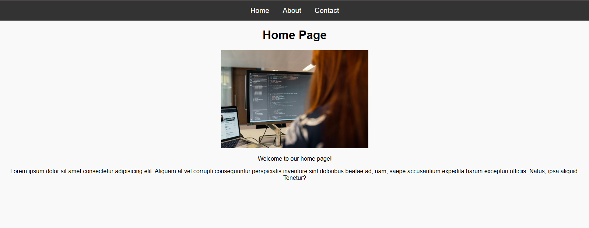
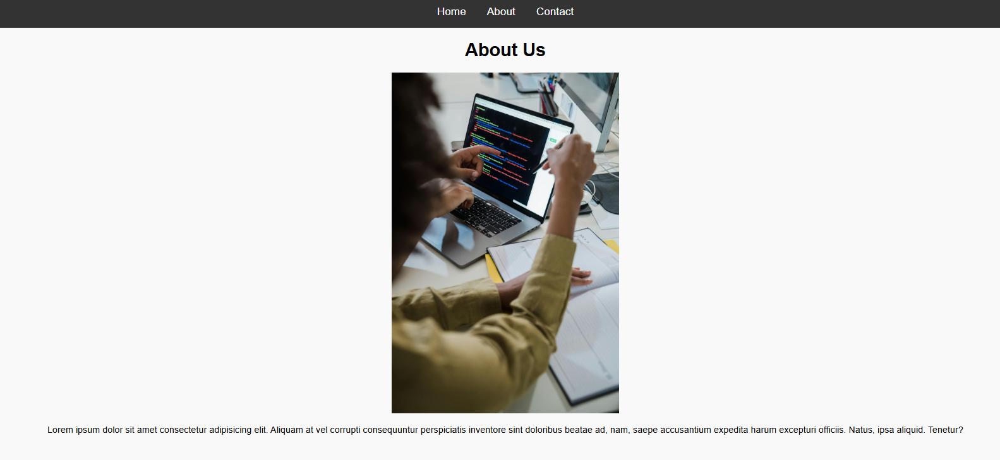
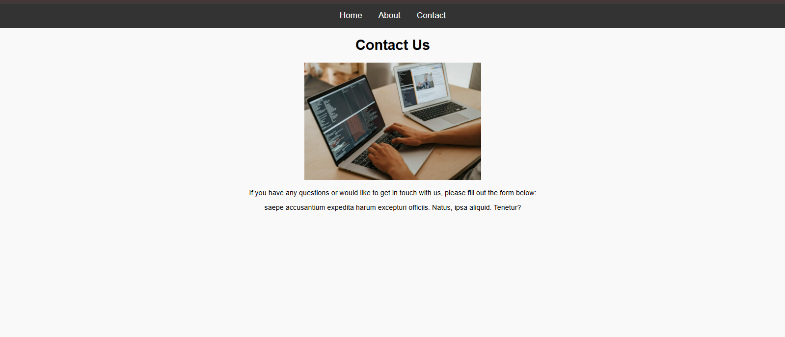

# 🚀 Express Multipage Website


A simple and clean multipage website built with Node.js and Express.js, demonstrating routing and static file handling (HTML, CSS, images).

---

## 📌 Features

- Express routing (Home, About, Contact)
- Static file serving (CSS, Images)
- Organized folder structure
- Beginner-friendly project

---

## 📂 Project Structure
```
EXPRESS-MULTIPAGE/
│
├── public/
│   ├── css/
│   │   └── style.css
│   └── images/
│       ├── c.jpg
│       ├── code.jpg
│       └── coding.jpg
│
├── views/
│   ├── index.html
│   ├── about.html
│   └── contact.html
│
├── app.js
├── package.json
└── README.md
```

---

## ⚙️ Installation & Setup

Clone the repository:

```bash
git clone https://github.com/your-username/express-multipage-site.git
cd express-multipage-site
```

Install dependencies:

```bash
npm install
```

Run the server:

```
node app.js
```

---

## 🌐 Usage

Open your browser and visit:

http://localhost:3000

Routes:
- / → Home Page  
- /about → About Page  
- /contact → Contact Page  

---

## 🖼️ Screenshots

### Home Page


### About Page


### Contact Page



---

## 💡 Future Improvements

- Add responsive design
- Use template engine (EJS / Pug)
- Add navbar and footer
- Deploy online (Render / Vercel)

---

## 📜 License

MIT License

---

## 👨‍💻 Author

Ifra Malik
https://github.com/ifra489

---

⭐ If you like this project, give it a star!
EOF
